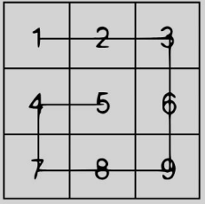

# Desafio Tecnico em Java para processo seletivo na Supera.

[](https://developer.mozilla.org/es/docs/Web/JavaScript) 

## Entregas

```
| Desafio - Resistores
| Desafio - Snail
| Desafio - Sistema de Gerenciamento
de Tarefas
```

## Desafio 1 

Função deverá receber uma string contendo o valor de ohms a ser convertido em cores:

- 0: preto
- 1: marrom
- 2: vermelho
- 3: laranja
- 4: amarelo
- 5: verde
- 6: azul
- 7: violeta
- 8: cinza
- 9: branco

## Desafio 2

Dado uma matriz N x N, retorne os valores organizados dos elementos mais externos para os mais
internos, em sentido horário.



## Desafio 3


## Links

* Impacto: [Stack Overflow](https://survey.stackoverflow.co/2023/#most-popular-technologies-language) | [GitHub](https://github.blog/2023-11-08-the-state-of-open-source-and-ai/) | [Índice TIOBE](https://www.tiobe.com/tiobe-index/) | [Google Trends](https://trends.google.es/trends/explore?cat=5&date=today%205-y&q=%2Fm%2F02p97,%2Fm%2F05z1_,%2Fm%2F07sbkfb&hl=es)

* [Documentacao Java](https://docs.oracle.com/en/java/javase/22/docs/api/index.html)


##  Ola, meu nome é Tarcisio Valentim.
### 💻 Fullstack Developer | iOS & Android | ReactJs | NodeJs.


Eu sou desenvolvedor de software desde 2020. Desde 2018, combino meu trabalho desenvolvendo aplicativos com a criação de conteúdo educacional sobre programação.

Pode me encontrar em:


<div style="display: flex; justify-content: center;">

<a class="social" href="mailto:tarcisio.word@gmail.com" alt="Gmail" >
  
</a>

<a class="social" href="https://www.linkedin.com/in/devtvas/" alt="Linkedin" >
  
</a>

<a class="social" href="https://api.whatsapp.com/send?phone=5562998025403" alt="WhatsApp" >
  
</a>

</div>

